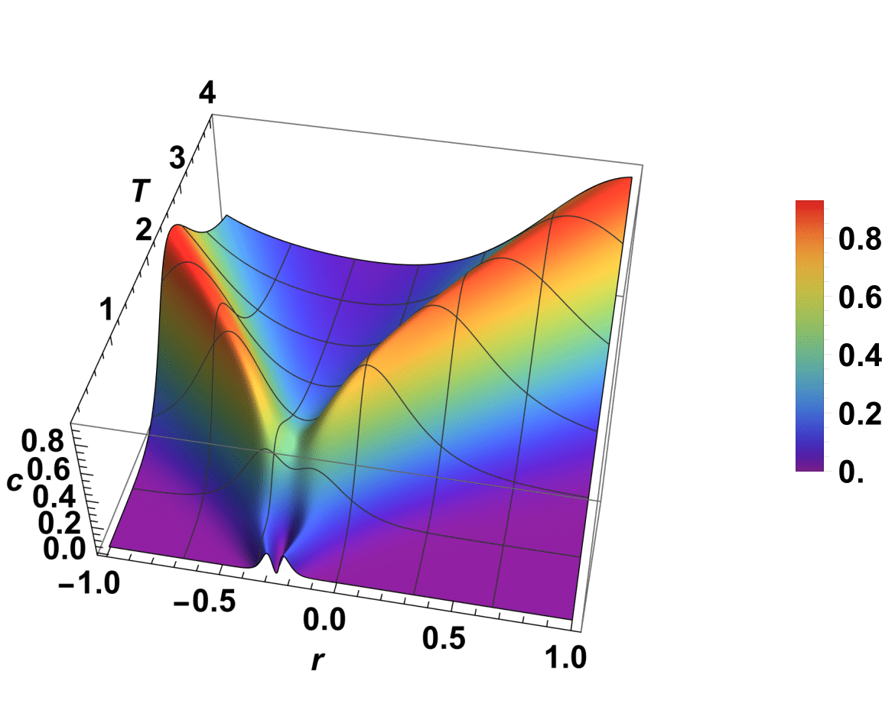
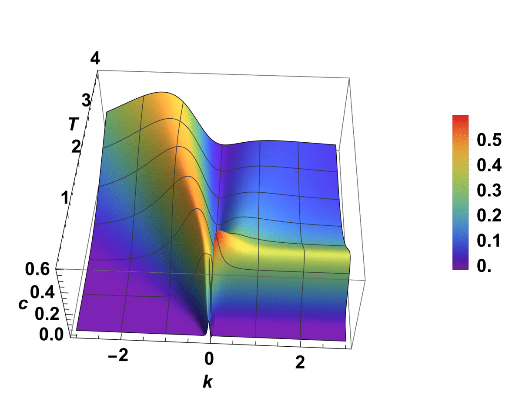
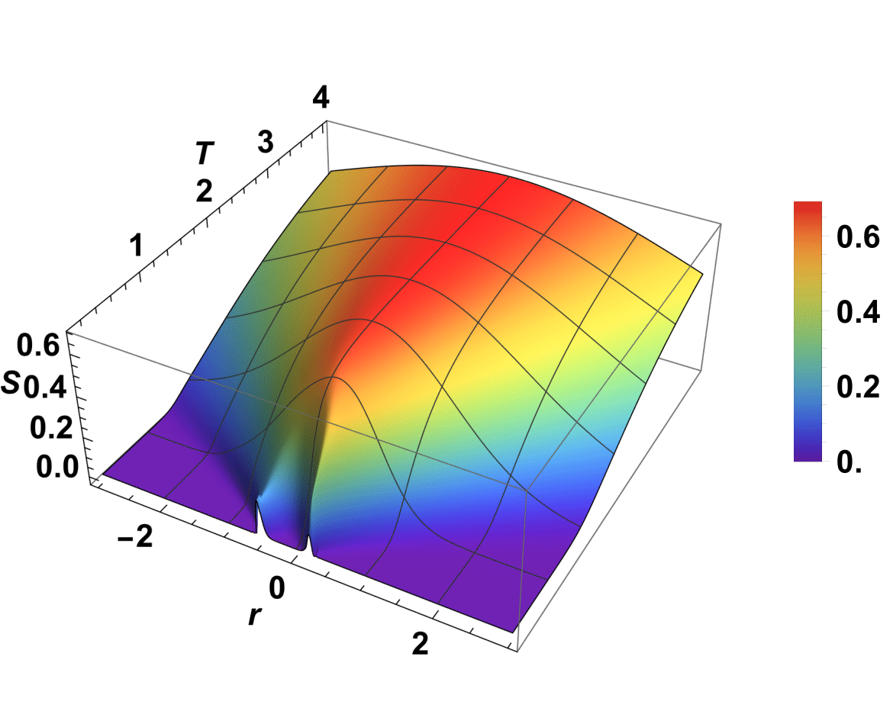
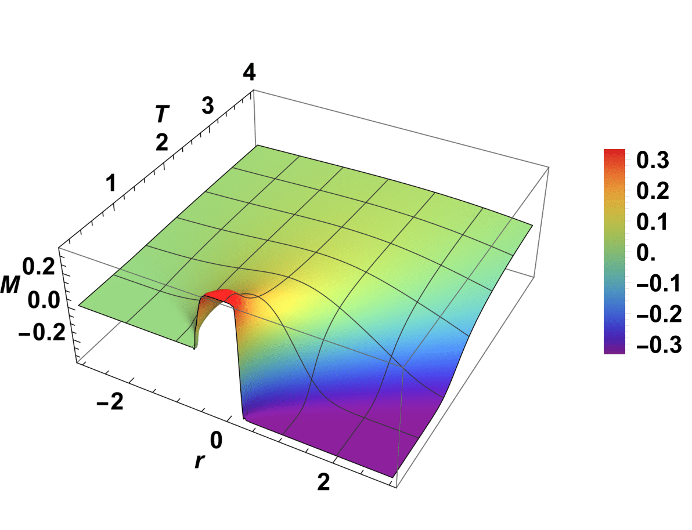
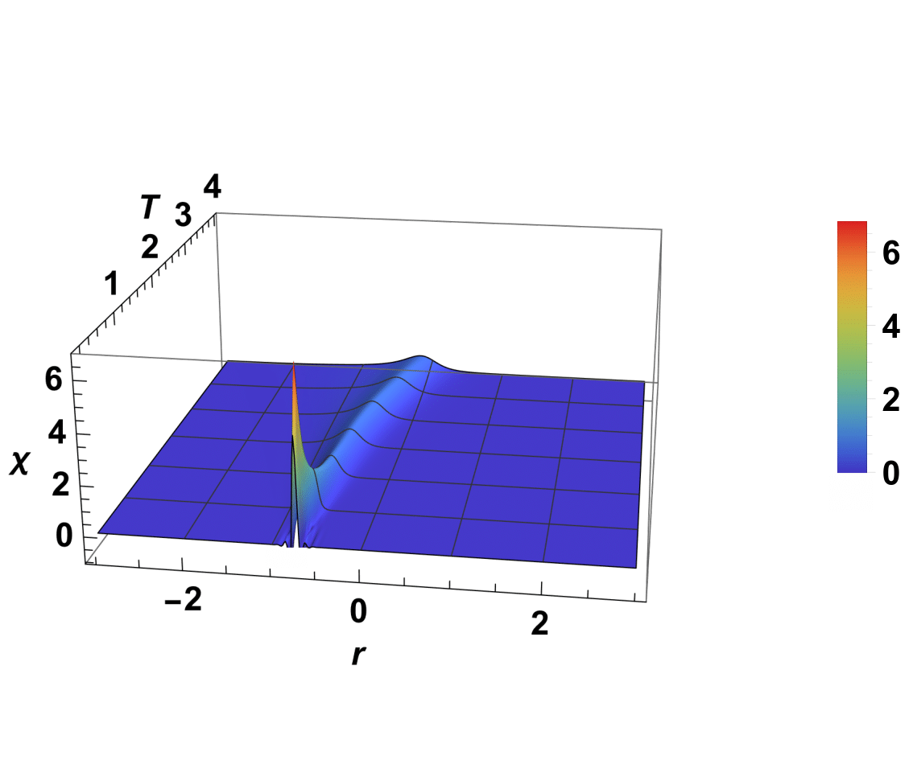
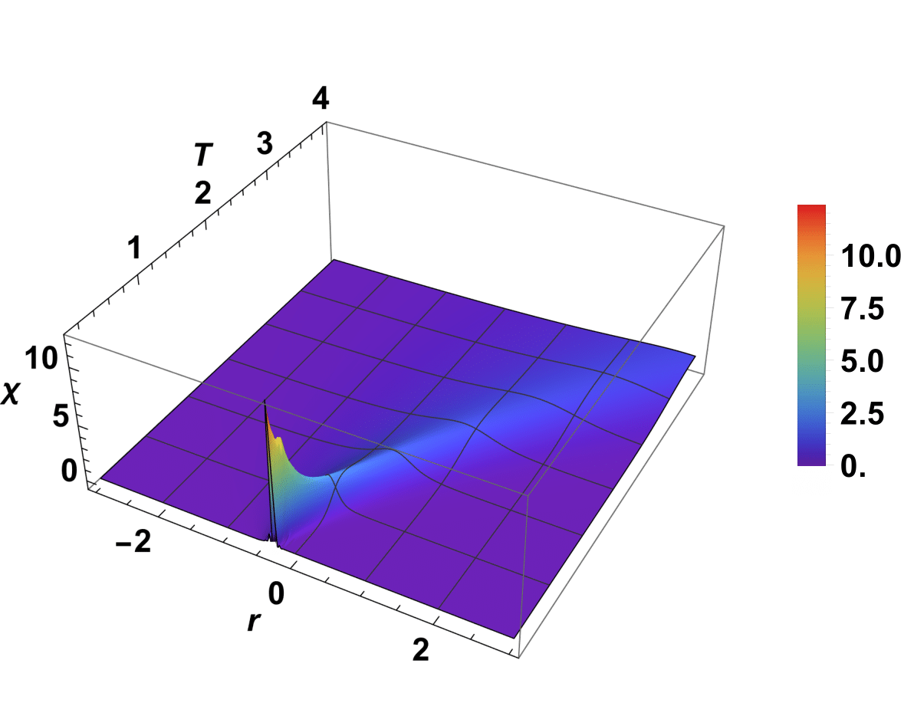

# Numerical methods and modeling
## Репозиторий, содержащий примеры программной реализации различных численных методов и моделирования, применяемых в течение моей научной работы. Ознакомиться с ними можно в файле Code

#### Основные элементы данного репозитория — коды в папке Code, которая содержит:
 * Файл на языке MATLAB, который моделирует поведение физических характеристик трехцепочечной модели Изинга и осуществляет графическую демонстрацию получаемых результатов
 * Файл на языке Python, численно моделирующий различные случаи применения численных методов Якоби и Зейделя для проверки одной из гипотез, поставленных по отношению к данным методам, и их последующего исследования
 * Директория с Python-файлами, большинство из которых содержат программные реализации различных численных методов, применяемых для решения популярных математических и физических задач. Данные реализации применялись при разработке телеграм-бота, осуществляющего научные вычисления прямо в чате при получении соответствующего запроса

Примеры графиков физических величин трехцепочечной модели Изинга, построенные с применением численного моделирования:

  
  
  
   
  
  
  

